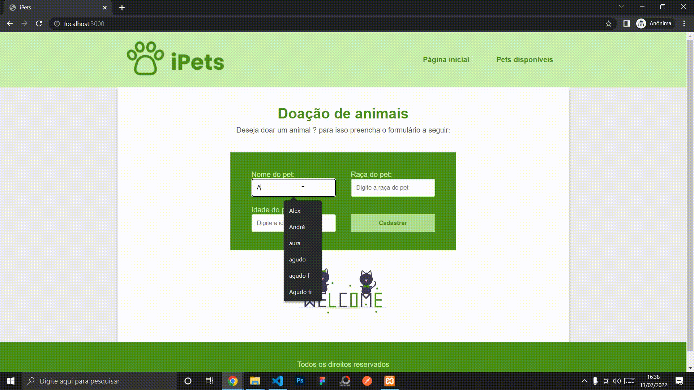
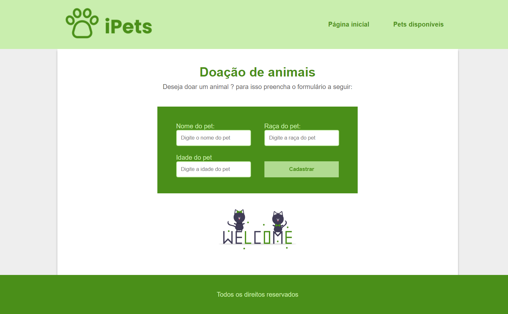

# Crud iPets 🐶😺

Esse é um projeto basico de um CRUD utilizando <strong>Node.js, Express, Handlebars e MySQL.</strong>
 
 
Estou estudando Node e estou fazendo esses pequenos projetos pra fixar os conceitos na cabeça, esse em especifico foi feito para praticar um pouco mais sobre os comandos basicos de MySQL.
 
Ele conta com as funções basicas de: <strong> Create, Read, Update e Delete. </strong>
 
 
O projeto foi feito do 0 aplicando somente o que eu aprendi, não conta com verificações e também não está separado por routers e poderia ter feito outras melhorias mas como eu disse foi feito apenas para por em pratica os códigos do MySQL.
 
 

